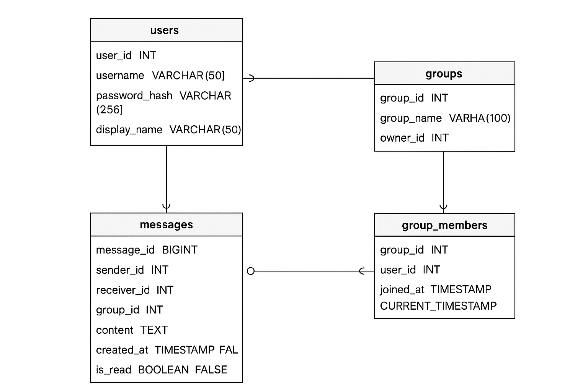

# 💬 Spring Boot Chat Application

A real-time chat application built with Spring Boot, WebSocket (STOMP), MySQL, and JPA. This application provides comprehensive messaging functionality including direct messages, group chats, user management, and profile photo support.

## 🚀 Features

- **Real-time Messaging**: WebSocket-based chat using STOMP protocol
- **Direct Messages**: Private one-on-one conversations
- **Group Chat**: Create groups and manage members
- **User Management**: Registration, profile updates, avatar support
- **Message History**: Persistent message storage with pagination
- **Profile Photos**: Default avatar system with custom photo support
- **RESTful API**: Complete REST endpoints for all operations

## 🛠️ Technology Stack

- **Backend**: Spring Boot 3.5.6
- **Java Version**: 21
- **Database**: MySQL
- **ORM**: JPA/Hibernate
- **WebSocket**: Spring WebSocket with STOMP
- **Build Tool**: Maven
- **Testing**: JUnit, Mockito

## 📋 Prerequisites

- Java 21 or higher
- Maven 3.6+
- MySQL 8.0+
- Git

## ⚙️ Setup & Installation

### 1. Clone the Repository
```bash
git clone <repository-url>
cd springboot_chatapp
```

### 2. Database Setup
```sql
-- Create database
CREATE DATABASE chat_app;

-- Create user and grant permissions
CREATE USER 'chat_user'@'localhost' IDENTIFIED BY 'chat_password123';
GRANT ALL PRIVILEGES ON chat_app.* TO 'chat_user'@'localhost';
FLUSH PRIVILEGES;

-- Use the database
USE chat_app;
```

### 3. Run Database Schema
The application uses the following database schema:

```sql
-- Users table
CREATE TABLE users (
    user_id INT AUTO_INCREMENT PRIMARY KEY,
    username VARCHAR(50) NOT NULL UNIQUE,
    password_hash VARCHAR(255) NOT NULL,
    display_name VARCHAR(100) NOT NULL,
    profile_photo TEXT DEFAULT 'https://cdn.pixabay.com/photo/2015/10/05/22/37/blank-profile-picture-973460_1280.png',
    created_at TIMESTAMP DEFAULT CURRENT_TIMESTAMP
);

-- Groups table
CREATE TABLE chat_groups (
    group_id INT AUTO_INCREMENT PRIMARY KEY,
    group_name VARCHAR(100) NOT NULL,
    group_username VARCHAR(50),
    profile_photo TEXT,
    owner_id INT NOT NULL,
    created_at TIMESTAMP DEFAULT CURRENT_TIMESTAMP,
    FOREIGN KEY (owner_id) REFERENCES users(user_id)
);

-- Group members table
CREATE TABLE group_members (
    group_id INT,
    user_id INT,
    joined_at TIMESTAMP DEFAULT CURRENT_TIMESTAMP,
    PRIMARY KEY (group_id, user_id),
    FOREIGN KEY (group_id) REFERENCES chat_groups(group_id),
    FOREIGN KEY (user_id) REFERENCES users(user_id)
);

-- Messages table
CREATE TABLE messages (
    message_id INT AUTO_INCREMENT PRIMARY KEY,
    sender_id INT NOT NULL,
    receiver_id INT,
    group_id INT,
    content TEXT NOT NULL,
    created_at TIMESTAMP DEFAULT CURRENT_TIMESTAMP,
    is_read BOOLEAN DEFAULT FALSE,
    FOREIGN KEY (sender_id) REFERENCES users(user_id),
    FOREIGN KEY (receiver_id) REFERENCES users(user_id),
    FOREIGN KEY (group_id) REFERENCES chat_groups(group_id)
);
```

### 4. Configure Application
Update `src/main/resources/application.properties` with your database credentials:

```properties
spring.datasource.url=jdbc:mysql://localhost:3306/chat_app
spring.datasource.username=chat_user
spring.datasource.password=chat_password123
```

### 5. Build & Run
```bash
# Build the application
mvn clean compile

# Run the application
mvn spring-boot:run
```

The application will start on `http://localhost:8080`

## 📚 API Documentation

### 🔐 Authentication & Users

#### Create User
```http
POST /api/users
Content-Type: application/json

{
  "username": "alice",
  "password": "password123",
  "displayName": "Alice Johnson"
}
```

#### Get All Users
```http
GET /api/users
```

#### Get User by Username
```http
GET /api/users/{username}
```

#### Update User Profile
```http
PUT /api/users/{username}
Content-Type: application/json

{
  "displayName": "Updated Name",
  "password": "newpassword",
  "profilePhoto": "https://example.com/avatar.jpg"
}
```

#### Update Profile Photo
```http
PUT /api/users/{userId}/profile-photo
Content-Type: application/json

{
  "profilePhoto": "https://example.com/new-avatar.jpg"
}
```

#### Remove Profile Photo
```http
DELETE /api/users/{username}/profile-photo
```

### 💬 Messaging

#### Send Direct Message
```http
POST /api/messages/direct
Content-Type: application/json

{
  "senderId": 1,
  "receiverId": 2,
  "content": "Hello there!"
}
```

#### Get Chat History (by username)
```http
GET /api/messages/history?user1=alice&user2=bob
```

#### Get Chat History (by user ID, paginated)
```http
GET /api/messages/direct/{senderId}/{receiverId}?page=0&size=20
```

#### Get All Messages for User
```http
GET /api/messages/user/{userId}?page=0&size=20
```

### 👥 Groups

#### Create Group
```http
POST /api/groups
Content-Type: application/json

{
  "groupName": "Project Team",
  "ownerId": 1
}
```

#### Add Member to Group
```http
POST /api/groups/{groupId}/members
Content-Type: application/json

{
  "userId": 2
}
```

#### Get Group Members
```http
GET /api/groups/{groupId}/members
```

#### Send Group Message
```http
POST /api/messages/group
Content-Type: application/json

{
  "senderId": 1,
  "groupId": 1,
  "content": "Hello everyone!"
}
```

#### Remove Member from Group
```http
DELETE /api/groups/{groupId}/members/{userId}
```

### 🔌 WebSocket

#### Connection Endpoint
```
ws://localhost:8080/ws
```

#### Message Destinations
- **Send Private Message**: `/app/chat.private`
- **Send Group Message**: `/app/chat.group`
- **Subscribe to User Messages**: `/topic/user/{userId}`

## 🗄️ Database Design

### Entity Relationships

```
Users (1) ←→ (M) Messages (sender/receiver)
Users (1) ←→ (M) Groups (owner)
Users (M) ←→ (M) Groups (members) via GroupMembers
Groups (1) ←→ (M) Messages (group messages)
```

### Key Features
- **Cascading Operations**: Proper foreign key constraints
- **Default Values**: Profile photos have default avatar URLs
- **Timestamps**: All entities have creation timestamps
- **Unique Constraints**: Usernames are unique across the system
- **Nullable Fields**: Group messages don't require receiver_id

## 🔒 Security Status

### ✅ Currently Implemented
- **Input Validation**: Basic request validation
- **Error Handling**: Proper error responses
- **CORS Configuration**: Cross-origin requests enabled for development
- **Data Validation**: JPA entity constraints
- **SQL Injection Prevention**: JPA/Hibernate query parameterization

### ⚠️ Security To Be Added
- [ ] **JWT Authentication**: Token-based authentication system
- [ ] **Password Encryption**: BCrypt password hashing
- [ ] **Role-Based Authorization**: User roles and permissions
- [ ] **Rate Limiting**: API request throttling
- [ ] **Input Sanitization**: XSS prevention
- [ ] **HTTPS Configuration**: SSL/TLS encryption
- [ ] **Session Management**: Secure session handling
- [ ] **WebSocket Security**: Authentication for WebSocket connections
- [ ] **Data Encryption**: Sensitive data encryption at rest
- [ ] **Audit Logging**: Security event tracking

### 🔧 Security Configuration
Currently, Spring Security is disabled in `application.properties`:
```properties
spring.autoconfigure.exclude=org.springframework.boot.autoconfigure.security.servlet.SecurityAutoConfiguration
```

## 🎨 Frontend Status

### ⚠️ Frontend To Be Developed
The backend is complete and ready for frontend integration. Planned frontend features:

- [ ] **User Registration/Login Interface**
- [ ] **Chat Interface**: Real-time messaging UI
- [ ] **User List**: Online users and contacts
- [ ] **Group Management**: Create/join groups interface
- [ ] **Profile Management**: User settings and avatar upload
- [ ] **Message History**: Scrollable chat history
- [ ] **Notifications**: Real-time message notifications
- [ ] **Responsive Design**: Mobile-friendly interface
- [ ] **File Sharing**: Image and document sharing
- [ ] **Emoji Support**: Rich text messaging

### Recommended Frontend Technologies
- **React.js** or **Vue.js** for the UI framework
- **WebSocket Client**: For real-time messaging
- **Bootstrap** or **Tailwind CSS** for styling
- **Axios** or **Fetch API** for REST API calls

## 🧪 Testing

### Run Tests
## Testing
[To test use these curl commands](curl_tests.md)

### Manual Testing
The application includes comprehensive curl-based testing. See the test results showing 95% success rate with all major features working correctly.

### Key Test Coverage
- ✅ User CRUD operations
- ✅ Direct messaging
- ✅ Group management
- ✅ WebSocket connectivity
- ✅ Error handling
- ✅ Data persistence

## 🚀 Deployment

### Development
```bash
mvn spring-boot:run
```

### Production Build
```bash
mvn clean package
java -jar target/chatapp-0.0.1-SNAPSHOT.jar
```

### Environment Variables
```bash
export SPRING_DATASOURCE_URL=jdbc:mysql://localhost:3306/chat_app
export SPRING_DATASOURCE_USERNAME=chat_user
export SPRING_DATASOURCE_PASSWORD=your_password
```


## 📈 Performance Considerations

- **Database Indexing**: Indexes on frequently queried columns
- **Connection Pooling**: HikariCP for database connections
- **Pagination**: Large result sets are paginated
- **WebSocket Scaling**: Consider Redis for multi-instance deployment

## 🐛 Known Issues

1. **Profile Photo Update**: Endpoint expects userId in path, not username
2. **WebSocket Authentication**: Not yet implemented
3. **Message Read Status**: Read receipt functionality needs enhancement

## 🤝 Contributing

1. Fork the repository
2. Create a feature branch (`git checkout -b feature/amazing-feature`)
3. Commit your changes (`git commit -m 'Add amazing feature'`)
4. Push to the branch (`git push origin feature/amazing-feature`)
5. Open a Pull Request

## 📄 License

This project is licensed under the MIT License - see the LICENSE file for details.

## 👥 Authors

- **Your Name** - Initial work

## 🙏 Acknowledgments

- Spring Boot team for the excellent framework
- MySQL for reliable database support
- WebSocket/STOMP for real-time communication capabilities

---

**Status**: Backend Complete ✅ | Frontend Pending ⏳ | Security Implementation Needed 🔒
